# DIY Stock Chart — Software Design Document

> *Created by Anti Gravity (Claude Opus 4.6 Thinking)*

> **Scope**: This document covers the complete High-Level Design (HLD), Low-Level Design (LLD), Data Model, and Cross-Cutting Concerns of the `diy-stock-chart-app` Python desktop application.
> See also: [Algorithm Deep-Dive](chart-app/algorithm.md) · [README](readme.md)

---

## Table of Contents

1. [High-Level Design (HLD)](#1-high-level-design)
   - 1.1 [System Overview](#11-system-overview)
   - 1.2 [Key Design Principles](#12-key-design-principles)
   - 1.3 [Component Architecture](#13-component-architecture)
   - 1.4 [Threading & Concurrency Model](#14-threading--concurrency-model)
   - 1.5 [Data Flow — Startup Sequence](#15-data-flow--startup-sequence)
   - 1.6 [Data Flow — Data Acquisition](#16-data-flow--data-acquisition)
   - 1.7 [Technology Stack](#17-technology-stack)
2. [Low-Level Design (LLD)](#2-low-level-design)
   - 2.1 [Class Diagram](#21-class-diagram)
   - 2.2 [Module-by-Module Method Breakdown](#22-module-by-module-method-breakdown)
   - 2.3 [State Management Model](#23-state-management-model)
   - 2.4 [Caching & Persistence Strategy](#24-caching--persistence-strategy)
   - 2.5 [Rendering Pipeline](#25-rendering-pipeline)
   - 2.6 [Interaction Flow — Window Change](#26-interaction-flow--window-change)
   - 2.7 [Interaction Flow — Resampling Pipeline](#27-interaction-flow--resampling-pipeline)
   - 2.8 [Interaction Flow — Crosshair](#28-interaction-flow--crosshair)
3. [Data Model](#3-data-model)
   - 3.1 [Entity-Relationship Diagram](#31-entity-relationship-diagram)
4. [Cross-Cutting Concerns](#4-cross-cutting-concerns)
   - 4.1 [Logging](#41-logging)
   - 4.2 [Error Handling](#42-error-handling)
   - 4.3 [DPI Awareness](#43-dpi-awareness)
   - 4.4 [Performance Considerations](#44-performance-considerations)

---

## 1. High-Level Design

### 1.1 System Overview

The DIY Stock Chart App is a single-process, multi-threaded Python desktop application that provides interactive financial charting with technical indicators. It follows a **Producer-Consumer** architecture where network I/O is offloaded to background threads while the UI thread remains responsive.

The system is composed of five Python modules:

| Module                  | Role                                      | Primary Class / Functions          |
| :---------------------- | :---------------------------------------- | :--------------------------------- |
| `app_stock_chart.py`    | Application shell & orchestrator          | `StockChartApp`                    |
| `chart_drawing.py`      | Rendering pipeline & mouse interaction    | `ChartPlotter`                     |
| `stock_util.py`         | Data acquisition, caching, indicators     | Module-level functions             |
| `info_panel.py`         | Floating fundamental-data overlay         | `InfoPanel`                        |
| `watchlist.py`          | Watchlist persistence & management UI     | `WatchListManager`, `WatchListUI`  |

A sixth file, `debug_price.py`, is a standalone CLI tool for data-quality analysis and is not part of the main application runtime.

### 1.2 Key Design Principles

| Principle                           | Implementation                                                                                     |
| :---------------------------------- | :------------------------------------------------------------------------------------------------- |
| **Responsive UI**                   | Network I/O runs on daemon threads; results arrive via `queue.Queue`; UI polls with `root.after()` |
| **Zero external databases**         | All persistence uses flat CSV files under `csv/` and `conf/`                                       |
| **Incremental data loading**        | Daily/hourly cache is appended rather than re-downloaded                                           |
| **Gapless financial charting**      | Integer-index plotting with custom label formatters eliminates weekend/holiday gaps                 |
| **Global asset awareness**          | Crypto, Forex, and Futures follow a 24/7 calendar-day model distinct from equity market hours      |
| **Settings persistence**            | All UI toggle states survive across sessions via `conf/settings.json`                              |

### 1.3 Component Architecture

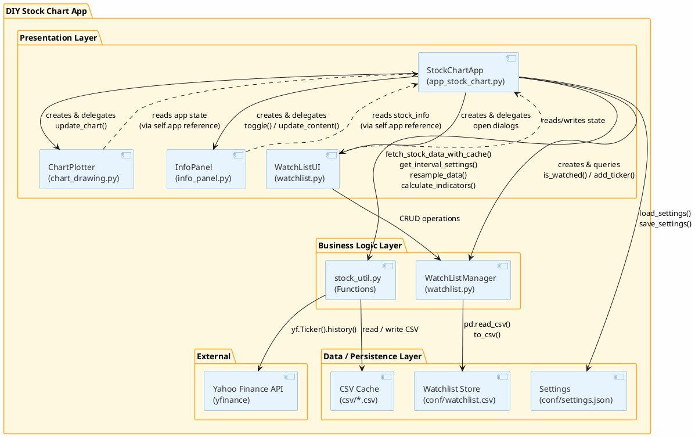

### 1.4 Threading & Concurrency Model

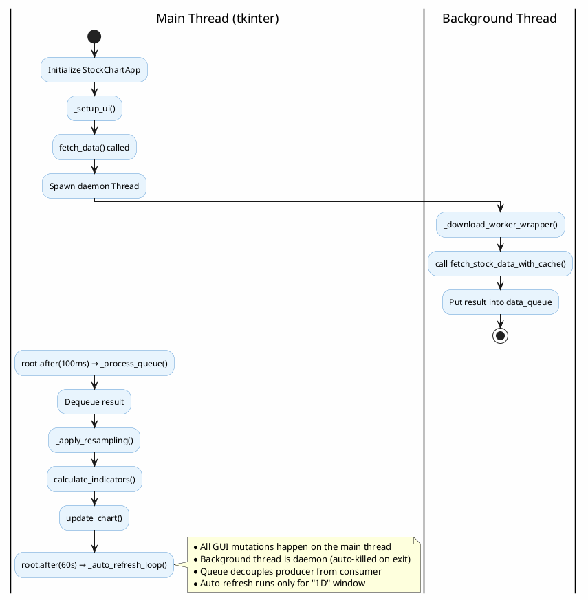

**Concurrency rules**:
- The `queue.Queue` is the sole communication channel between threads.
- The background thread writes to the queue; the main thread reads.
- `_process_queue()` is polled every **100 ms** via `root.after(100, ...)`.
- `_auto_refresh_loop()` fires every **60 s** but only re-fetches when `auto_refresh` is `True` and window is `"1D"`.
- All `tk` / `matplotlib` API calls occur exclusively on the main thread.

### 1.5 Data Flow — Startup Sequence

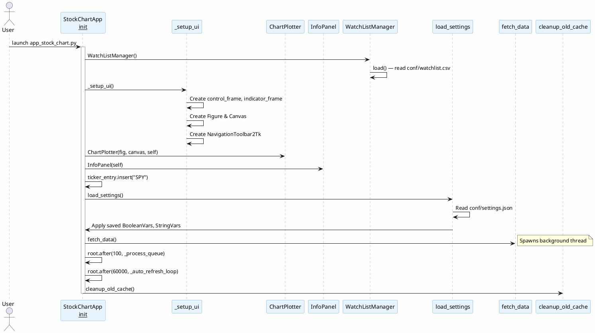

### 1.6 Data Flow — Data Acquisition

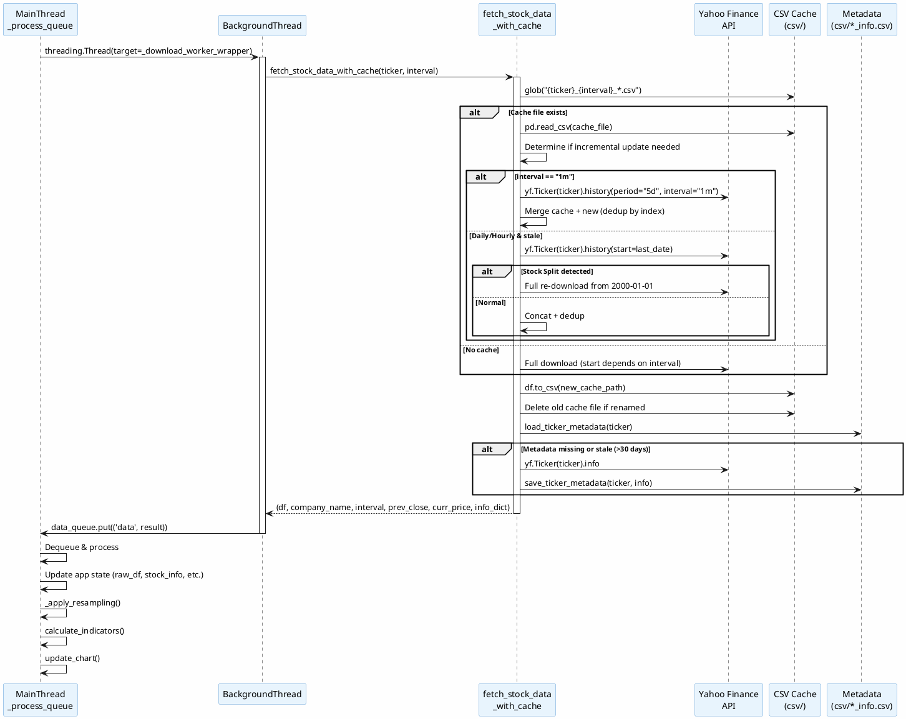

### 1.7 Technology Stack

| Layer           | Technology                                     | Version / Notes                      |
| :-------------- | :--------------------------------------------- | :----------------------------------- |
| Language        | Python                                         | Tested on 3.13.2                     |
| GUI Framework   | `tkinter` + `ttk`                              | Stdlib                               |
| Charting        | `matplotlib` (+ `FigureCanvasTkAgg`)           | Embedded in tkinter                  |
| Data Fetching   | `yfinance`                                     | Unofficial Yahoo Finance API wrapper |
| Data Processing | `pandas`, `numpy`                              | DataFrames, rolling windows          |
| Indicators      | `finta` (TA library)                           | MACD, RSI, Bollinger Bands           |
| Persistence     | Flat CSV + JSON files                          | No database                          |
| Platform        | Windows 11                                     | DPI awareness via `ctypes`           |

---

## 2. Low-Level Design

### 2.1 Class Diagram

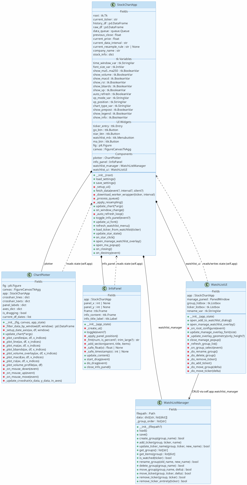

### 2.2 Module-by-Module Method Breakdown

#### 2.2.1 `app_stock_chart.py` — `StockChartApp`

| Method                         | Visibility | Description                                                                                                  |
| :----------------------------- | :--------- | :----------------------------------------------------------------------------------------------------------- |
| `__init__(root)`               | public     | Initializes all state variables, creates components, loads settings, kicks off first `fetch_data()` and timers |
| `load_settings()`              | public     | Reads `conf/settings.json` and applies values to `tk.BooleanVar` / `tk.StringVar` / `tk.IntVar`              |
| `save_settings()`              | public     | Serializes current toggle states to `conf/settings.json`                                                     |
| `_setup_ui()`                  | private    | Builds control_frame (ticker, time buttons, font), indicator_frame (checkboxes, combos), chart_frame (Figure) |
| `fetch_data(event, interval, silent)` | public | Resolves interval from `time_window_var` if not given; spawns daemon thread for download                     |
| `_download_worker_wrapper(ticker, interval)` | private | Thread target; calls `fetch_stock_data_with_cache()`; pushes result to `data_queue`              |
| `_process_queue()`             | private    | Dequeues results; updates `raw_df`, `stock_info`, `previous_close`, `current_price`; calls `_apply_resampling()` |
| `_apply_resampling()`          | private    | Calls `resample_data()`, applies pre/post-market filtering, gap-filling for 1m data, then `calculate_indicators()` |
| `update_chart(*args)`          | public     | Delegates to `self.plotter.update_chart()`                                                                   |
| `on_window_change()`           | public     | Determines if interval change requires new data fetch or just re-resampling                                  |
| `_auto_refresh_loop()`         | private    | Every 60 s; calls `fetch_data(silent=True)` if auto_refresh and window is "1D"                               |
| `toggle_info_panel(event)`     | public     | Delegates to `self.info_panel.toggle()`                                                                      |
| `update_ui_font()`             | public     | Applies `font_size_var` to all tkinter default fonts, menus, and child components                            |
| `refresh_watchlist_menu()`     | public     | Rebuilds `watchlist_menu` cascading submenus from `WatchListManager` data                                    |
| `load_ticker_from_watchlist(ticker)` | public | Sets ticker in entry and calls `fetch_data()`                                                               |
| `update_star_state()`          | public     | Sets star button text to ★ or ☆ based on `WatchListManager.is_watched()`                                    |
| `on_star_click()`              | public     | Toggles ticker in/out of watchlists                                                                          |
| `open_manage_watchlist_overlay()` | public  | Delegates to `WatchListUI.open_manage_watchlist_overlay()`                                                   |
| `open_ma_popup()`              | public     | Creates movable Toplevel with custom checkbox rows for MA toggles                                            |
| `on_closing()`                 | public     | Saves settings, quits root, exits process                                                                    |
| `on_destroy(event)`            | public     | Safety exit on root widget destroy                                                                           |

#### 2.2.2 `chart_drawing.py` — `ChartPlotter`

| Method                                        | Visibility | Description                                                                                          |
| :-------------------------------------------- | :--------- | :--------------------------------------------------------------------------------------------------- |
| `__init__(fig, canvas, app_state)`             | public     | Stores refs, initializes crosshair state, binds mouse events                                         |
| `_filter_data_by_window(df, window)`           | private    | Slices DataFrame to the requested time window (20Y…1D) using `pd.DateOffset`                         |
| `_setup_date_axis(ax, df, window)`             | private    | Custom axis formatter with collision resolution; supports 1D/hourly/daily/long-term modes            |
| `update_chart(*args)`                          | public     | Master render: clears figure, creates GridSpec, plots price/MACD/RSI panels, sets up crosshair       |
| `_plot_candles(ax, df, x_indices)`             | private    | Draws up (green hollow) and down (red filled) candlesticks using `vlines` + `bar`                    |
| `_plot_line(ax, df, x_indices)`                | private    | Draws simple close-price line in `#007ACC` blue                                                      |
| `_plot_ma(ax, df, x_indices)`                  | private    | Plots MA 5/20/50/60/100/120/200/250 lines with color coding                                         |
| `_plot_bbands(ax, df, x_indices)`              | private    | Plots upper/lower Bollinger Bands with gray fill                                                     |
| `_plot_volume_overlay(ax, df, x_indices)`      | private    | Twin-axis volume bars at bottom 25% (ylim = max_vol × 4)                                            |
| `_plot_macd(ax, df, x_indices)`                | private    | MACD line + Signal line + histogram bar chart                                                        |
| `_plot_rsi(ax, df, x_indices)`                 | private    | RSI line with overbought (70) / oversold (30) thresholds                                             |
| `_plot_volume_profile(ax, df)`                 | private    | Fixed-bin horizontal bar chart on twin x-axis; distributes volume proportionally across price bins    |
| `_on_mouse_down(event)`                        | private    | Sets `is_dragging=True`; resolves target axis; calls `_update_crosshair()`                          |
| `_on_mouse_up(event)`                          | private    | Hides crosshair elements; sets `is_dragging=False`                                                   |
| `_on_mouse_move(event)`                        | private    | If dragging, updates crosshair to current mouse position                                             |
| `_update_crosshair(x_data, y_data, in_axes)`   | private    | Snaps X to nearest bar; updates vertical/horizontal lines; renders date, OHLC, and volume labels     |

#### 2.2.3 `stock_util.py` — Module Functions

| Function                                                  | Description                                                                                                |
| :-------------------------------------------------------- | :--------------------------------------------------------------------------------------------------------- |
| `get_stock_history(ticker, start, end, interval, prepost)` | Thin wrapper around `yf.Ticker().history()` with `auto_adjust=False`                                      |
| `cleanup_old_cache(csv_dir_path, days)`                    | Deletes CSV files in `csv/` older than 7 days                                                             |
| `get_metadata_path(ticker)`                                | Returns `Path("csv/{ticker}_info.csv")`                                                                   |
| `load_ticker_metadata(ticker)`                             | Reads sidecar CSV; validates freshness (30-day TTL); checks for expected keys                             |
| `save_ticker_metadata(ticker, info_dict)`                  | Writes key-value pairs to sidecar CSV; escapes commas                                                     |
| `fetch_stock_data_with_cache(ticker, interval)`            | Core caching engine: branch 1m (always fresh 5d) vs daily/hourly (incremental); handles splits; returns 6-tuple |
| `get_ticker_name(ticker)`                                  | Fetches only `shortName`/`longName` via `yf.Ticker().info`                                                |
| `get_interval_settings(window)`                            | Maps time window string to `(target_interval, resample_rule)` tuple                                      |
| `resample_data(df, rule)`                                  | Applies OHLCV resampling; handles custom integer-day rules ("2D","3D") and standard time rules ("MS","W-MON") |
| `calculate_indicators(df)`                                 | Adds MA 5/20/50/60/100/120/200/250, MACD, Signal, RSI, BB_UPPER/MIDDLE/LOWER columns to DataFrame         |

#### 2.2.4 `info_panel.py` — `InfoPanel`

| Method                                     | Visibility | Description                                                                    |
| :----------------------------------------- | :--------- | :----------------------------------------------------------------------------- |
| `__init__(app_state)`                      | public     | Stores app ref; calls `_create_ui()`                                           |
| `_create_ui()`                             | private    | Builds draggable bordered Frame with header (title + close ✕) and content area |
| `toggle(event)`                            | public     | Shows / hides panel based on `self.app.show_info`                              |
| `_apply_panel_position()`                  | private    | Centers panel on first show; applies saved `(panel_x, panel_y)` position       |
| `_fmt(num, is_percent, trim_large)`        | private    | Formats numbers: T/B/M suffixes, percent handling, comma separators            |
| `_add_section(parent, title, items)`       | private    | Renders a titled two-column grid of key-value pairs                            |
| `_safe_float(v)`                           | private    | Safely parses string to float, handling semicolons and commas                  |
| `_safe_timestamp(v)`                       | private    | Safely parses string to unix timestamp int                                     |
| `update_content()`                         | public     | Clears and rebuilds panel content with Key Statistics + Valuation sections      |
| `start_drag(event)` / `do_drag(event)`     | public     | Implements drag-to-move via root-relative mouse delta                          |
| `close_info_panel()`                       | public     | Sets `show_info=False` and hides panel                                         |

#### 2.2.5 `watchlist.py` — `WatchListManager`

| Method                                    | Visibility | Description                                                                |
| :---------------------------------------- | :--------- | :------------------------------------------------------------------------- |
| `__init__(filepath)`                      | public     | Sets `filepath=Path("conf/watchlist.csv")`; calls `load()`                |
| `load()`                                  | public     | Reads CSV into `data` dict keyed by group name; preserves insertion order  |
| `save()`                                  | public     | Flattens `data` respecting `_group_order` and writes to CSV via pandas     |
| `create_group(group_name)`                | public     | Creates empty group; appends to `_group_order`                             |
| `add_ticker(group, ticker, name)`         | public     | Adds ticker if not duplicate in group; auto-creates group if needed        |
| `update_ticker_name(group, ticker, name)` | public     | Updates name for existing ticker in group                                  |
| `get_groups()`                            | public     | Returns `_group_order` list                                                |
| `get_items(group)`                        | public     | Returns list of `{ticker, name}` dicts for group                           |
| `is_watched(ticker)`                      | public     | Scans all groups for ticker presence                                       |
| `rename_group(old, new)`                  | public     | Renames key in `data` and `_group_order`                                   |
| `delete_group(group_name)`                | public     | Removes group from `data` and `_group_order`                               |
| `move_group(group_name, delta)`           | public     | Swaps group position in `_group_order` by ±1                               |
| `move_ticker(group, ticker, delta)`       | public     | Swaps ticker position within group list by ±1                              |
| `remove_ticker(group, ticker)`            | public     | Removes ticker from specific group                                         |
| `remove_ticker_entirely(ticker)`          | public     | Removes ticker from all groups                                             |

#### 2.2.6 `watchlist.py` — `WatchListUI`

| Method                                    | Visibility | Description                                                               |
| :---------------------------------------- | :--------- | :------------------------------------------------------------------------ |
| `__init__(app_state)`                     | public     | Stores app reference                                                      |
| `open_add_to_watchlist_dialog()`          | public     | Creates floating overlay anchored to ★ button; multi-select listbox + new group entry |
| `open_manage_watchlist_overlay()`         | public     | Creates centered PanedWindow overlay with group list (left) and ticker list (right) |
| `_on_root_configure(event)`               | private    | Dynamically adjusts overlay height on window resize                       |
| `update_manage_overlay_font(size)`        | public     | Propagates font changes to all overlay widgets                            |
| `_update_overlay_geometry(only_height)`   | private    | Calculates width from content text metrics; height = 50% of window        |
| `close_manage_popup()`                    | public     | Destroys overlay; refreshes menu and star state                           |
| `_refresh_group_list()`                   | private    | Reloads group names into left listbox                                     |
| `_on_group_select(event)`                 | private    | Populates right listbox with group's tickers                              |
| `_do_rename_group()`                      | private    | Renames selected group via `WatchListManager.rename_group()`              |
| `_do_delete_group()`                      | private    | Deletes group after confirmation dialog                                   |
| `_do_remove_ticker()`                     | private    | Removes selected ticker from current group                                |
| `_do_add_ticker()`                        | private    | Prompts for ticker symbol; fetches name; adds to current group            |
| `_do_move_group(delta)`                   | private    | Moves group up/down in list order                                         |
| `_do_move_ticker(delta)`                  | private    | Moves ticker up/down within its group                                     |

### 2.3 State Management Model

All mutable application state lives on `StockChartApp`. There is no separate state container or event bus.

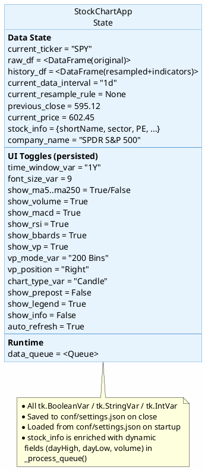

### 2.4 Caching & Persistence Strategy

#### File Layout

```
chart-app/
├── conf/
│   ├── settings.json        # UI state (toggles, font, window)
│   └── watchlist.csv         # Watchlist groups and tickers
└── csv/
    ├── SPY_1d_2026-02-12.csv       # OHLCV price cache
    ├── SPY_1m_2026-02-12.csv       # Intraday cache
    ├── SPY_1h_2026-02-12.csv       # Hourly cache
    ├── SPY_info.csv                # Metadata sidecar
    └── ...
```

#### Naming Conventions

| File Pattern                         | Contents                                    | Example                        |
| :----------------------------------- | :------------------------------------------ | :----------------------------- |
| `{ticker}_{interval}_{date}.csv`     | OHLCV time-series data                      | `SPY_1d_2026-02-12.csv`       |
| `{ticker}_info.csv`                  | Static metadata key-value pairs             | `SPY_info.csv`                 |
| `debug_{ticker}_{interval}_{date}.csv` | Debug output from `debug_price.py`          | `debug_ORCL_1h_2026-01-01.csv` |

#### TTL & Freshness Rules

| Artifact                          | TTL                          | Refresh Trigger                                              |
| :-------------------------------- | :--------------------------- | :----------------------------------------------------------- |
| OHLCV cache (`*_{interval}_*.csv`) | Until data is stale          | Incremental fetch if `last_date < today` or intraday         |
| Metadata sidecar (`*_info.csv`)    | 30 days                      | Full API re-fetch if >30 days or missing expected keys       |
| Settings (`settings.json`)         | Permanent                   | Overwritten on every app close                               |
| Watchlist (`watchlist.csv`)        | Permanent                   | Written on every CRUD operation                              |
| Old cache cleanup                  | Files older than 7 days      | Runs once at startup via `cleanup_old_cache()`               |

#### Metadata Validation Keys

The metadata loader (`load_ticker_metadata`) forces a refresh if any of these keys are missing:
`dividendRate`, `yield`, `fiftyTwoWeekLow`, `beta`, `previousClose`.

### 2.5 Rendering Pipeline

```plantuml
@startuml
skinparam backgroundColor #FEFEFE
skinparam activity {
  BackgroundColor #E8F4FD
  BorderColor #5B9BD5
}

start
:ChartPlotter.update_chart() called;

if (history_df is empty?) then (yes)
  :Clear figure;
  :canvas.draw();
  stop
endif

:Set global font from font_size_var;
:_filter_data_by_window(history_df, window);

if (window == "1D"?) then (yes)
  :Construct fixed 1-min index\n(09:30-16:00 or 00:00-23:59 for global);
  :Reindex df to full trading day;
endif

:fig.clear();
:Reset crosshair_lines, panel_labels, axes_dict;

:Determine panels: [price] + [macd?] + [rsi?];
:Calculate height ratios\n(price=100-15*N, others=15 each);
:Create GridSpec(N panels);

:Create integer x_indices = [0..len(df)-1];
:Store df.index as current_df_dates;

partition "Price Panel" {
  if (show_prepost && 1D?) then (yes)
    :Draw pre/post market shading\n(axvspan at <09:30 and >=16:00);
  endif
  if (show_volume?) then (yes)
    :_plot_volume_overlay() — twin Y axis;
  endif
  if (chart_type == "Line"?) then (yes)
    :_plot_line();
  else (Candle)
    :_plot_candles();
  endif
  :_plot_ma();
  :_plot_bbands();
  if (show_vp?) then (yes)
    :_plot_volume_profile() — twin X axis;
  endif
  :Calculate y_min/y_max from Low/High/BBands/MAs;
  :Apply ylim with 5% padding;
}

partition "Sub-Panels" {
  if (MACD shown?) then (yes)
    :_plot_macd();
  endif
  if (RSI shown?) then (yes)
    :_plot_rsi();
  endif
}

:_setup_date_axis() on bottom panel;
:Set xlim(-0.5, len-0.5);
:Setup crosshair labels (hidden);
:Setup crosshair vert/horiz lines (hidden);
:canvas.draw();
stop

@enduml
```

### 2.6 Interaction Flow — Window Change

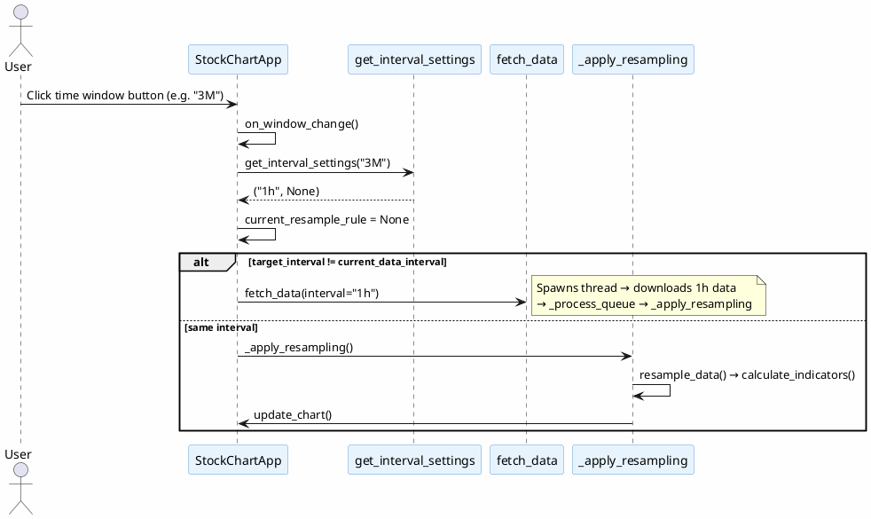

### 2.7 Interaction Flow — Resampling Pipeline

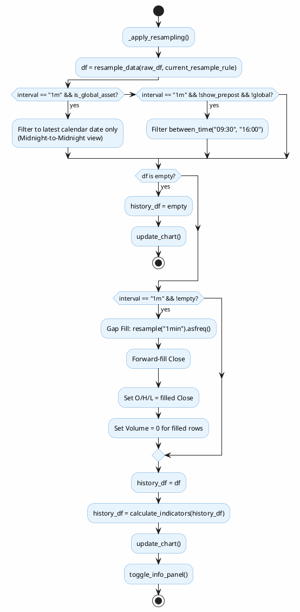

### 2.8 Interaction Flow — Crosshair

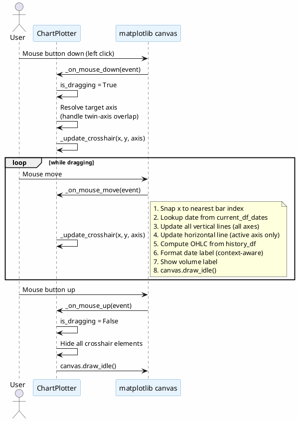

---

## 3. Data Model

### 3.1 Entity-Relationship Diagram

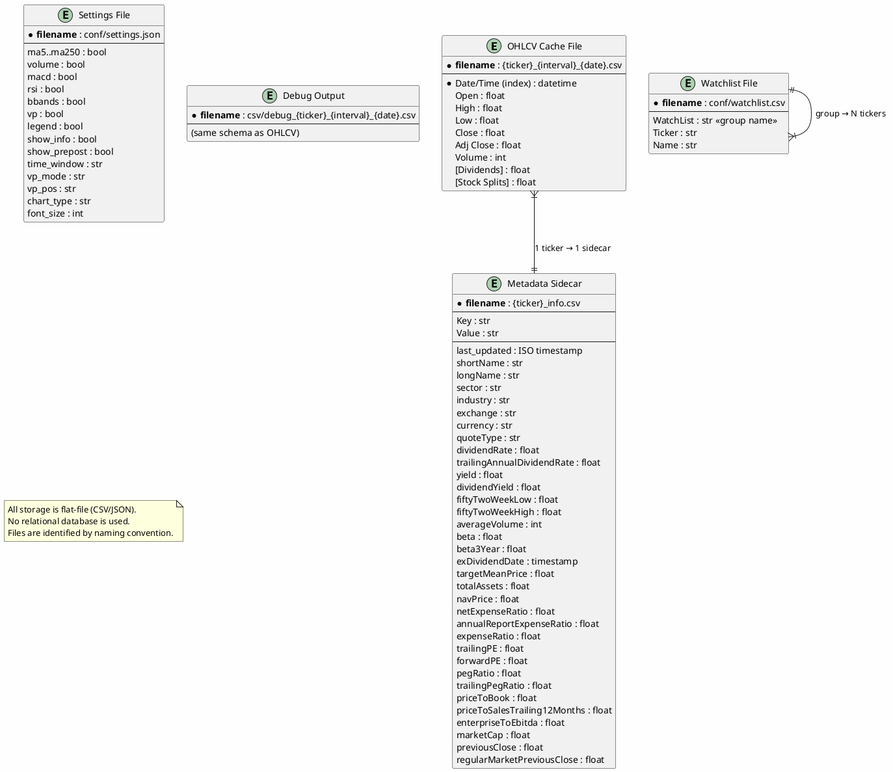

---

## 4. Cross-Cutting Concerns

### 4.1 Logging

| Module               | Logger Name  | Level   | Notes                                                  |
| :------------------- | :----------- | :------ | :----------------------------------------------------- |
| `app_stock_chart.py` | `__main__`   | INFO    | Configures root logger with `basicConfig()`            |
| `chart_drawing.py`   | module-level | INFO    | Uses `getLogger(__name__)`                             |
| `stock_util.py`      | module-level | INFO    | Also calls `basicConfig()` (redundant but harmless)    |
| `info_panel.py`      | module-level | INFO    | Uses `getLogger(__name__)`                             |
| `watchlist.py`       | module-level | INFO    | Uses `getLogger(__name__)`                             |

All modules use the standard `logging` library with format `%(asctime)s - %(levelname)s - %(message)s`. No log files are written; all output goes to `stderr`.

### 4.2 Error Handling

The application follows a **defensive fallback** strategy:

| Area                    | Strategy                                                                                       |
| :---------------------- | :--------------------------------------------------------------------------------------------- |
| Network failures        | `try/except` around all `yfinance` calls; returns empty `DataFrame` on failure                 |
| Corrupt cache           | `try/except` on `pd.read_csv()`; sets `df = None` to trigger full re-download                 |
| Missing metadata fields | Validation loop checks for expected keys; forces API refresh if any are missing                |
| Chart rendering         | Multiple `try/except` blocks; falls back to default axis limits `(0, 100)` on NaN/Inf         |
| Crosshair lookup        | Clips index to `[0, len-1]`; catches `KeyError` for OHLC row lookup                           |
| Settings I/O            | `try/except` on both `load_settings()` and `save_settings()`; uses defaults if file is missing |
| Thread errors           | Worker thread catches `Exception` and pushes `('error', str(e))` to queue                     |

### 4.3 DPI Awareness

```python
# app_stock_chart.py, lines 27-30
try:
    ctypes.windll.shcore.SetProcessDpiAwareness(1)
except Exception:
    pass
```

- Uses Windows `shcore.SetProcessDpiAwareness(1)` for **System DPI Aware** mode.
- Wrapped in `try/except` for cross-platform safety (no-op on non-Windows).
- The `font_size_var` (range 4–24) provides additional manual scaling for FHD vs 4K monitors.
- Font changes propagate to all widgets via `tkfont.nametofont("TkDefaultFont")` and `root.option_add()`.

### 4.4 Performance Considerations

| Concern                     | Mitigation                                                                                                    |
| :-------------------------- | :------------------------------------------------------------------------------------------------------------ |
| API rate limiting            | Incremental cache prevents full re-downloads; metadata cached for 30 days                                    |
| Large DataFrame rendering   | Integer-indexed plotting avoids `mdates` overhead; `draw_idle()` used for crosshair updates                  |
| Indicator computation       | `pandas.rolling()` runs in C-optimized NumPy; 8 MAs + MACD + RSI + BBands for ~2500 points < 5 ms           |
| Memory                      | Only one `raw_df` + one `history_df` in memory at a time per ticker; no historical multi-ticker storage      |
| Thread safety               | `queue.Queue` is the only shared mutable resource; all GUI mutations are main-thread only                    |
| Cache disk usage             | `cleanup_old_cache()` purges files > 7 days old at startup                                                   |
| Volume Profile rendering    | Row-by-row iteration (`df.iterrows()`) for VP distribution; potential bottleneck for large datasets          |
| Startup time                | Settings, watchlist, and cached data loaded from disk (< 50 ms); network fetch runs in background            |

---

## Window-to-Interval Mapping

Reference table for `get_interval_settings()`:

| Time Window | `target_interval` | `resample_rule` | Effective Bar Size | Notes                          |
| :---------- | :----------------- | :-------------- | :----------------- | :----------------------------- |
| `20Y`       | `1d`               | `MS`            | Monthly            | Month Start bucketing          |
| `10Y`       | `1d`               | `MS`            | Monthly            | Month Start bucketing          |
| `5Y`        | `1d`               | `W-MON`         | Weekly             | Week starting Monday           |
| `3Y`        | `1d`               | `3D`            | 3 Trading Days     | Custom integer-day resampling  |
| `2Y`        | `1d`               | `2D`            | 2 Trading Days     | Custom integer-day resampling  |
| `1Y`        | `1d`               | `None`          | Daily              | No resampling                  |
| `YTD`       | `1h` or `1d`       | `None`          | Hourly or Daily    | ≤90 days → 1h; >90 days → 1d  |
| `6M`        | `1d`               | `None`          | Daily              | No resampling                  |
| `3M`        | `1h`               | `None`          | Hourly             | No resampling                  |
| `1M`        | `1h`               | `None`          | Hourly             | No resampling                  |
| `1WK`       | `5m`               | `10min`         | 10 Minutes         | 5m fetched, resampled to 10m  |
| `1D`        | `1m`               | `None`          | 1 Minute           | No resampling                  |

---

## Moving Average Color Map

| MA Period | Color   | `tk.BooleanVar`   | Default |
| :-------- | :------ | :---------------- | :------ |
| MA 5      | Cyan    | `show_ma5`        | True    |
| MA 20     | Green   | `show_ma20`       | True    |
| MA 50     | Orange  | `show_ma50`       | True    |
| MA 60     | Blue    | `show_ma60`       | False   |
| MA 100    | Purple  | `show_ma100`      | True    |
| MA 120    | Magenta | `show_ma120`      | False   |
| MA 200    | Red     | `show_ma200`      | True    |
| MA 250    | Brown   | `show_ma250`      | True    |
