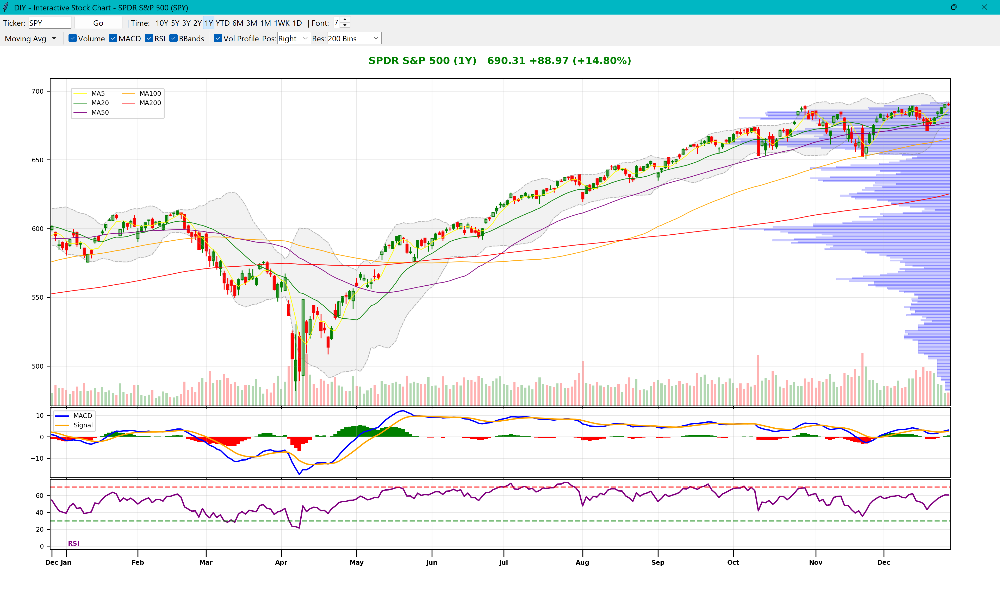
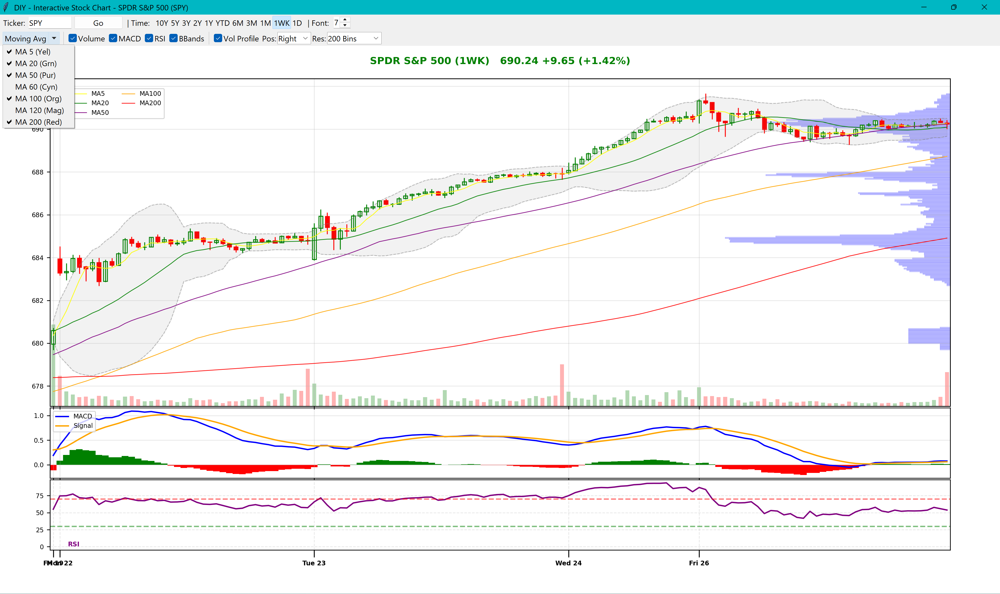
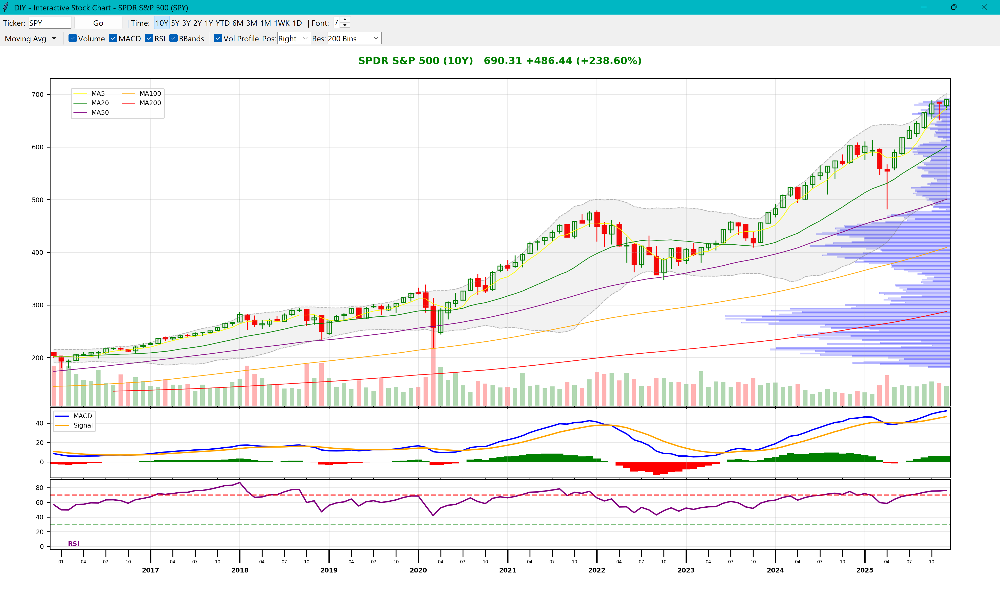
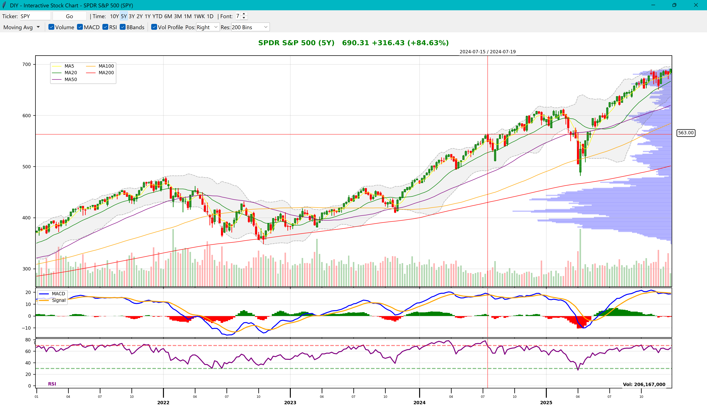
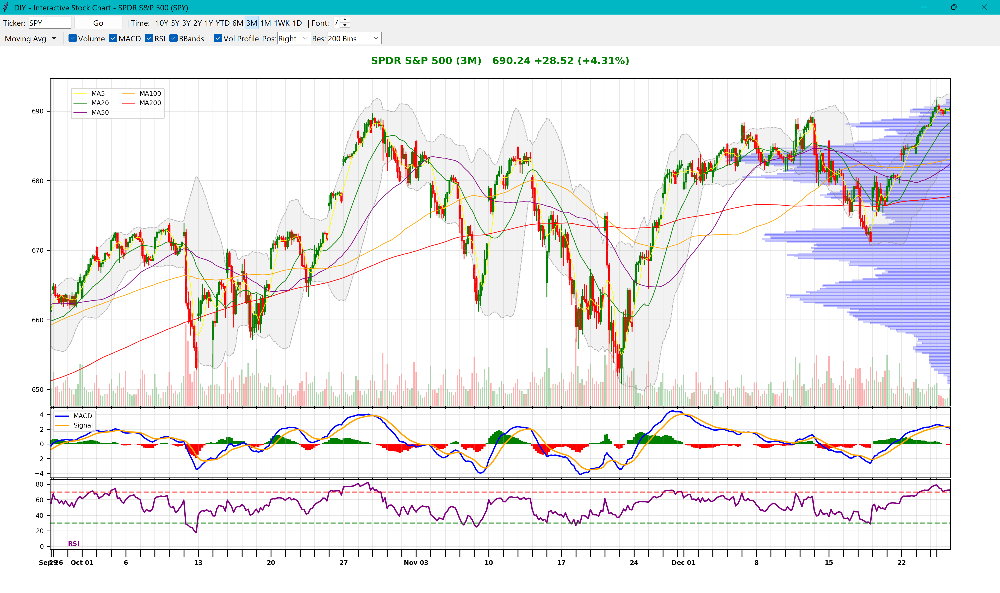

# DIY Stock Chart - Python Financial Analysis Tool

[](https://paypal.me/briannlhotmail/10) [](https://support.campfirecircle.org/diy/helping-the-kids-to-recover) [](https://give.sickkidsfoundation.com/fundraisers/brianli/healthy-kids)


- A interactive stock technical analysis application built with Python (`tkinter` + `matplotlib`). This project demonstrates how to build a simplistic stock charting tool from scratch, featuring Yahoo FInance free market data, advanced technical indicators, volume profiling, and a responsive custom UI.
- This is a 0-coding project and every line of code is done by Anti Gravity with Gemini 3.0 pro.
- Refer to the [AI readme](ai-readme.md) for more details on the prompt jurney.
## 🚀 Key Features

*   **Simplicity**: Simple GUI app without any need of web hosting or DB. All data are downloaded ad-hoc and maintained locally as CSVs. Minutes data are retrieved and kept in memory without writing too much junk on disk.
*   **Easy-use views**: For non-pro use simple most commonly used chart and indicators. **Price Volume** is rarely seen for free analysis tools and web apps.
*   **1-minute Data**: Fetches live market data (1-minute resolution) for intraday analysis using `yfinance`.
*   **Gap-less Time Axis**: Custom rendering engine that eliminates non-trading hours and weekends, ensuring a continuous, professional candlestick view.
*   **Smart Resampling**: 
    *   **10-Minute Weekly View**: High-precision weekly charts derived from 5-minute data.
    *   **Trading-Day Aggregation**: Custom 2D/3D bars that strictly respect trading days (ignoring weekends/holidays).
*   **Advanced Indicators**:
    *   **Moving Averages**: 7 configurable lines (MA 5, 20, 50, 60, 100, 120, 200).
    *   **Volume Profile (VP)**: Configurable fixed-bin precision (100, 200, 400 bins) with smart distribution.
    *   **Overlay Volume**: Volume bars displayed directly on the price chart to maximize vertical screen real estate.
    *   **MACD & RSI**: Dedicated sub-panels with dynamic resizing.
*   **Interactive UI**:
    *   **Crosshair**: Precision mouse tracking with Date, Time, Price, and Volume data.
    *   **FHD/4K Support**: Dynamic font scaling and layout adjustments for different screen resolutions.
    *   **Floating Info Panel**: Corner-snapping overlay showing detailed fundamentals (P/E, Market Cap, Beta) and Profile data.
    *   **Auto-Refresh**: Background "Always-On" refresh loop for active trading sessions.

[](https://paypal.me/briannlhotmail/10) [](https://support.campfirecircle.org/diy/helping-the-kids-to-recover) [](https://give.sickkidsfoundation.com/fundraisers/brianli/healthy-kids)

---

## 📸 Functionality Showcase

### 1. Multi-Timeframe Analysis
From **Intraday (1D)** to **Long-Term (10Y)**, the app adjusts resolution automatically to provide the best signal-to-noise ratio.
**1-Year Standard View (Daily Bars)**


**1-Week High Precision View (10m Bars)**


**Long Term 10-Year View (Monthly Bars)**


### 2. Technical Indicators
**Moving Averages & Crosshair**
The "DIY" specific features include a custom Moving Average bundle (including the institutional 50/200 Day lines and the trader-specific 20/60 lines) and a smart crosshair that reveals hidden data.



### 3. Volume Profile & Overlay
Volume is overlayed on the main chart (bottom 25%) to allow price action (like the MA200) to dip deep without losing context. The Volume Profile (right side) shows price distribution.



---

## 🛠 Operational Manual

### Controls Overview
| Control | Description |
| :--- | :--- |
| **Ticker** | Enter symbol (e.g., `SPY`, `NVDA`) and press **Enter** or **Go**. |
| **Time Window** | Select viewing duration: `1D` (Real-time), `1WK`, `1M`, `3M`, `6M`, `YTD`, `1Y`, `2Y`, `3Y`, `5Y`, `10Y`. |
| **Indicators** | Toggle panels: `Vol`, `MACD`, `RSI`. **Note**: Volume is an overlay on the main chart. |
| **Moving Avg** | Dropdown menu to toggle specific MAs (5, 20, 50, 60, 100, 120, 200). |
| **VP Mode** | Select Volume Profile precision: `100 Bins`, `200 Bins`, or `400 Bins`. |
| **Font** | Adjust UI scale (4-24pt) to optimize for your monitor (FHD vs 4K). |
| **Info Panel** | Toggle/Position the fundamental data overlay (`Hide`, `Bottom Left`, `Center`, `Right`). |

### Interactive Features
*   **Floating Info Panel**: Use the dropdown to snap the panel to any bottom corner. It auto-resizes based on font settings and context (Stock vs ETF).
    *   *Stocks*: Shows PE, PEG, Earnings Date, Dividend Rate/Yield.
    *   *ETFs*: Shows Expense Ratio, Net Assets, Beta (3Y), and SEC Yield.
*   **Left Click + Drag**: Measure price/time differences (Crosshair active).
*   **Auto-Refresh**: When viewing the **1D** chart, the data automatically reloads every 60 seconds to capture the latest minute bar.

[](https://paypal.me/briannlhotmail/10) [](https://support.campfirecircle.org/diy/helping-the-kids-to-recover) [](https://give.sickkidsfoundation.com/fundraisers/brianli/healthy-kids)

---

## ⚡ Algorithm & Implementation Details

The core strength of "DIY Stock Chart" lies in its custom rendering engine. Below are the specific mathematical and engineering approaches used to solve common financial visualization challenges.

### 1. Moving Averages Calculation
We implemented the standard Simple Moving Average (SMA) using the `pandas` library, which is highly optimized for vector operations.
*   **Formula**: $SMA_k = \frac{1}{k} \sum_{i=n-k+1}^{n} P_i$
*   **Implementation**:
    ```python
    # MAs are calculated using vectorized rolling windows
    df['ma20'] = df['close'].rolling(window=20).mean()
    df['ma50'] = df['close'].rolling(window=50).mean()
    # ...and so on for 5, 60, 100, 120, 200
    ```
*   **Performance**: Since `rolling(window=N)` is implemented in C via Pandas/Numpy, calculating 7 different MAs for 10 years of data (approx 2500 points) takes less than **2ms**.

### 2. Volume Profile (Custom Binning Algorithm)
Unlike standard indicators, the Volume Profile (VP) was implemented with a custom **Iterator Algorithm** to ensure precise distribution without relying on heavy external libraries.
*   **Step 1: Binning**: We dynamicallly calculate the bin height based on the visible price range.
    ```python
    bin_height = (price_max - price_min) / num_bins # e.g. 100
    ```
*   **Step 2: Distribution**: We iterate through *every single candle* in the visible range.
    *   If a candle spans from \$100 (Low) to \$105 (High), its volume is not just "dumped" into a single bin.
    *   Instead, we distribute its volume proportionally across all bins that fall between \$100 and \$105.
    *   **Snippet**:
        ```python
        vol_per_bin = row['volume'] / (end_bin - start_bin + 1)
        for i in range(start_bin, end_bin + 1):
             volume_profile[i] += vol_per_bin
        ```
*   **Result**: This creates a smooth, highly accurate probability distribution curve that works correctly even for volatile stocks with massive daily ranges.

### 3. Volume Overlay & Space Optimization
A key design requirement was maximizing vertical space for the Price Chart while keeping Volume visible.
*   **Strategy**: Instead of a separate Subplot (which steals 20% of screen height), we use a **Twin Axis**.
*   **Scaling Logic**: To prevent Volume bars from obscuring price candles, we manually set the Y-axis limit of the volume layer to be **4x** the maximum volume.
    ```python
    max_vol = df['volume'].max()
    ax_vol.set_ylim(0, max_vol * 4) # Forces bars to stay in bottom 25%
    ```
*   **Z-Order**: We set `ax_vol.set_zorder(0)` (Background) and `ax_price.set_zorder(1)` (Foreground). This allows moving averages (like MA200) to dip "behind" the volume bars without being visually obstructed.

### 4. RSI Calculation (`finta` Library)
For standard oscillations like RSI, we leverage the [`finta`](https://github.com/peerchemist/finta) library, which provides financial technical analysis indicators implemented in native Pandas.
*   **Input**: The entire DataFrame.
*   **Logic**: `df['rsi'] = TA.RSI(df)` (Default 14 periods).
*   **Why `finta`?**: It abstracts the complex Wilder's Smoothing logic required for accurate RSI, ensuring our values match standard broker platforms.

### 5. Dynamic Layout Engine (GridSpec)
The application uses Matplotlib's `GridSpec` with a **Weighted Ratio System** to ensure the Price Panel always dominates the screen.
*   **Rule**: "Price Panel must take at least 70% height + absorb any unused space."
*   **Algorithm**:
    ```python
    # Weights for fixed panels
    other_height = 15  # RSI / MACD each get 15% weight
    
    # Count active panels (excluding Price)
    num_others = count(MACD, RSI) 
    
    # Calculate Price Weight dynamically
    # If 2 panels: Price = 100 - 30 = 70 (Ratio 70:15:15)
    # If 0 panels: Price = 100 - 0 = 100 (Ratio 100)
    price_weight = 100 - (other_height * num_others) 
    
    ratios = [price_weight] + [other_height] * num_others
    ```
*   **Benefit**: Users can toggle side panels on/off, and the chart seamlessly re-flows to use 100% of the available pixels.

---

## 📦 Installation & Usage
* NOTES: Only tested on Windows 11, Python 3.13.2

1.  **Clone the Repo**
    ```bash
    git clone https://github.com/higgsboson-io/diy-stock-chart-app.git
    cd diy-stock-chart-app/chart-app
    ```

2.  **Install Dependencies**
    ```bash
    pip install pandas yfinance matplotlib numpy ta-lib
    ```
    *(Note: TA-Lib requires binary installation on Windows)*

3.  **Run the App**
    ```bash
    python app_stock_chart.py
    ```

---
- **License**: MIT Open Source
- **Author**: Higgs Boson Inovations

[](https://paypal.me/briannlhotmail/10) [](https://support.campfirecircle.org/diy/helping-the-kids-to-recover) [](https://give.sickkidsfoundation.com/fundraisers/brianli/healthy-kids)
