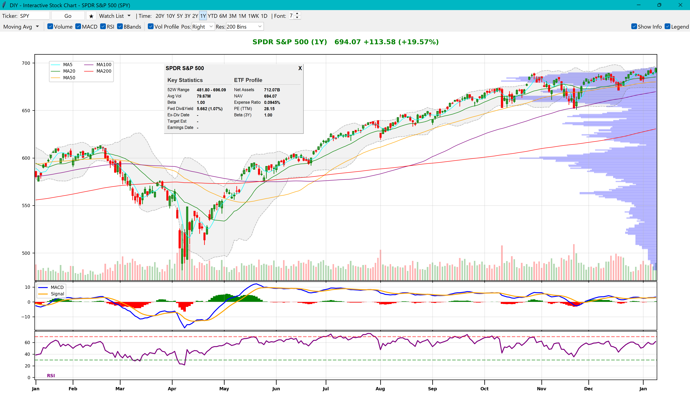
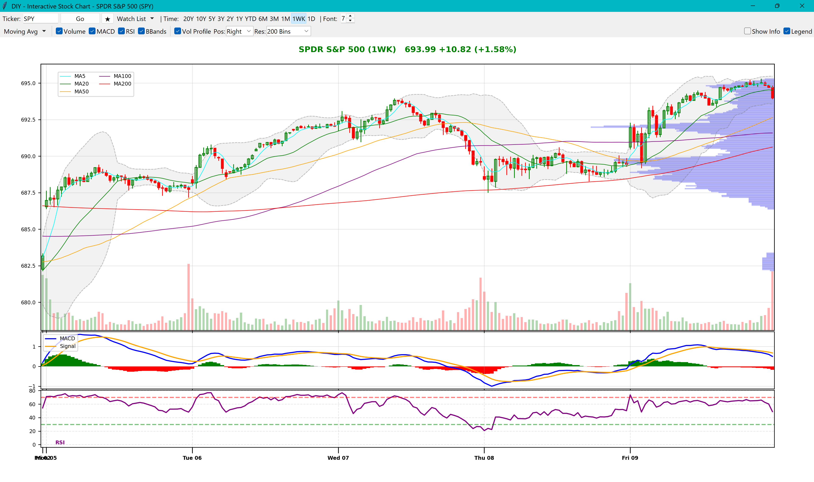
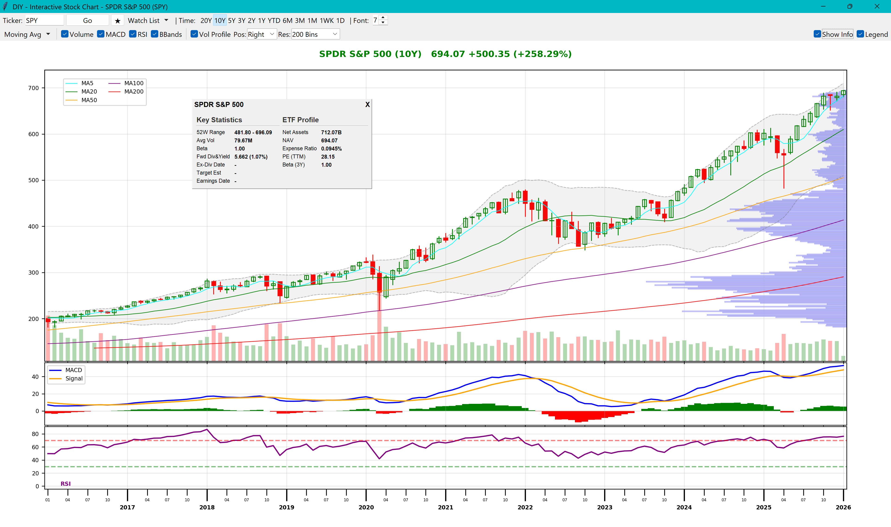
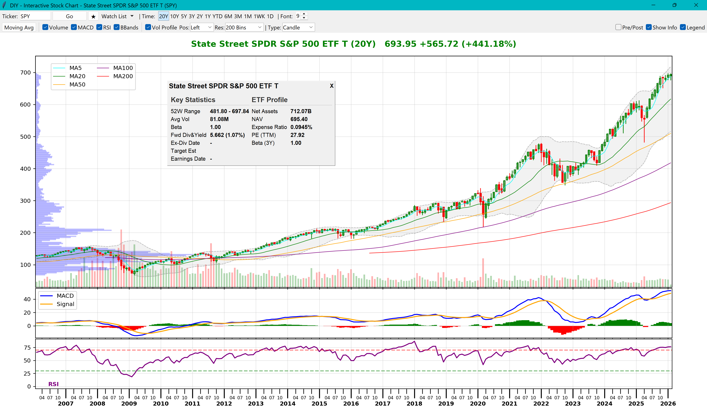
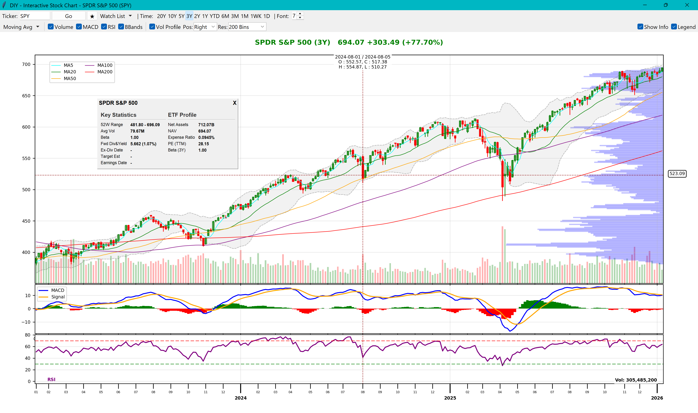
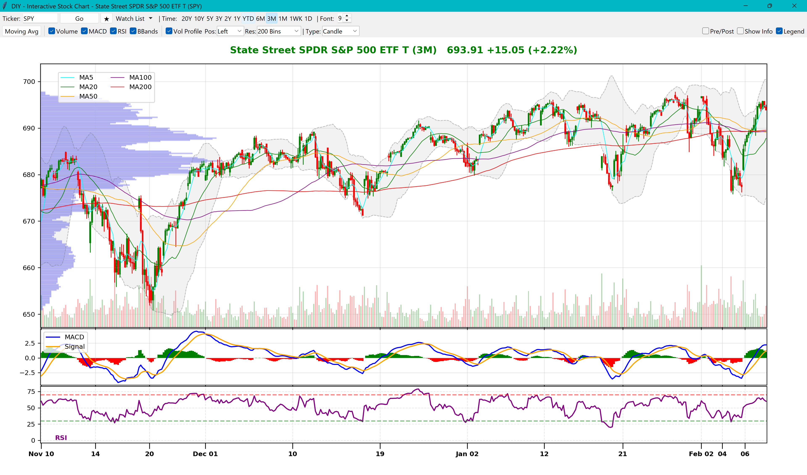
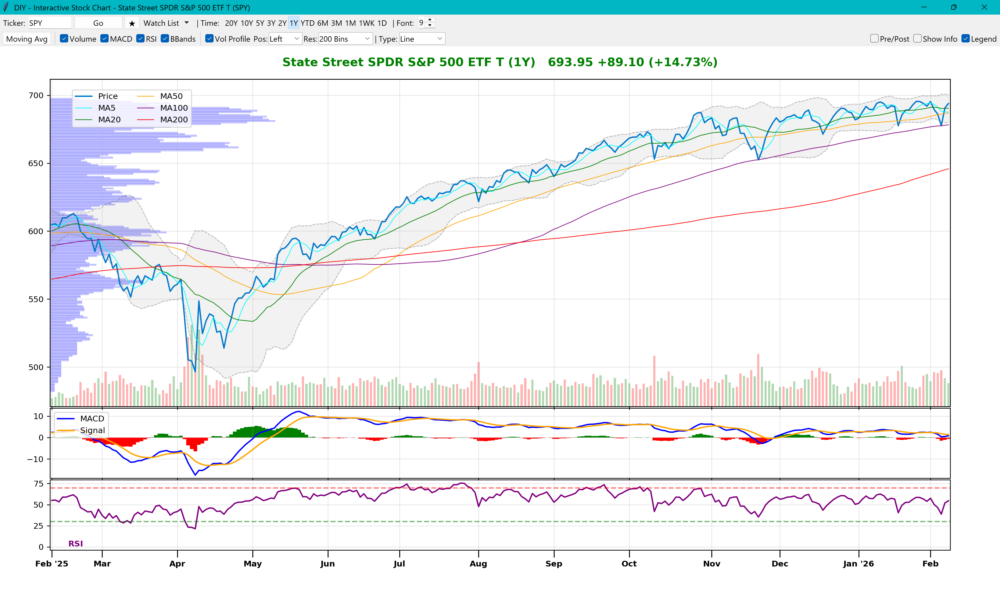

# DIY Stock Chart - Python Financial Analysis Tool

> *Updated by Anti Gravity (Claude Opus 4.6 Thinking)*

**DISCLAIMER: THIS ENTIRE PROJECT IS "VIBE CODED" BY ANTIGRAVITY (POWERED BY GEMINI 3.0 PRO) WITHOUT ANY EXTRA MANUAL CHANGE ON CODE AND README OTHER THAN PROMPT INTERACTION.**

[](https://paypal.me/briannlhotmail/10) [](https://support.campfirecircle.org/diy/helping-the-kids-to-recover) [](https://give.sickkidsfoundation.com/fundraisers/brianli/healthy-kids)


- A interactive stock technical analysis application built with Python (`tkinter` + `matplotlib`). This project demonstrates how to build a simplistic stock charting tool from scratch, featuring Yahoo FInance free market data, advanced technical indicators, volume profiling, and a responsive custom UI.
- This is a 0-coding project and every line of code is done by Anti Gravity with Gemini 3.0 pro.
- Refer to the [AI readme](ai-readme.md) for more details on the prompt jurney.

> 📖 **Documentation**: [Software Design Document](design.md) · [Algorithm Deep-Dive](chart-app/algorithm.md)

> [!WARNING]
> **Data Quality & Trading Risk**: This application relies on the unofficial, free Yahoo Finance API (`yfinance`). Data may be delayed, contain gaps (especially for intraday or global assets), or include erroneous ticks. This tool is for **educational/research purposes only** and should **NOT** be used for real-time trading or financial decisions. The developers are not responsible for any financial losses.

## 🚀 Key Features

*   **Simplicity**: Simple GUI app without any need of web hosting or DB. All data are downloaded ad-hoc and maintained locally as CSVs. Minutes data are retrieved and kept in memory without writing too much junk on disk.
*   **Easy-use views**: For non-pro use simple most commonly used chart and indicators. **Price Volume** is rarely seen for free analysis tools and web apps.
*   **Chart Types Toggle**: Switch instantly between **Candlestick** (OHLC) and **Line** (Close Price) visualization modes.
*   **1-minute Data**: Fetches live market data (1-minute resolution) for intraday analysis using `yfinance`.
*   **Global Assets Support**: Specialized 24/7 "Calendar Day" view for Crypto, Forex, and Futures (e.g., `BTC-USD`, `CAD=X`), bypassing standard market hours.
*   **Smart Smoothing**: Visual "Gap Filling" for illiquid stocks—automatically draws flat dashes for missing minutes to ensure chart continuity without altering raw data.
*   **Extended Hours Support**:
    *   **Pre/Post Market Data**: View full trading sessions (04:00 - 20:00) with a toggleable checkbox.
    *   **Visual Shading**: Distinct background shading for pre-market and post-market hours.
*   **Gap-less Time Axis**: Custom rendering engine that eliminates non-trading hours and weekends, ensuring a continuous, professional candlestick view.
*   **Smart "Breathing" Axis**:
    *   **Collision Resolution**: Intelligent labeling engine that backtracks to prevent text overlapping ("jamming") on any timeframe.
    *   **Context Aware**: Automatically adds Year/Month labels when context changes (e.g. `Jan '25`) and filters density for long-term views (3Y/5Y).
*   **Smart Resampling**: 
    *   **10-Minute Weekly View**: High-precision weekly charts derived from 5-minute data.
    *   **Trading-Day Aggregation**: Custom 2D/3D bars that strictly respect trading days (ignoring weekends/holidays).
*   **Advanced Indicators**:
    *   **Moving Averages**: 7 configurable lines (MA 5, 20, 50, 60, 100, 120, 200).
    *   **Volume Profile (VP)**: Configurable fixed-bin precision (100, 200, 400 bins) with smart distribution.
    *   **Overlay Volume**: Volume bars displayed directly on the price chart to maximize vertical screen real estate.
    *   **MACD & RSI**: Dedicated sub-panels with dynamic resizing.
*   **Interactive UI**:
    *   **Crosshair**: Precision mouse tracking with Date, Open/High/Low/Close Prices, and Volume data.
    *   **FHD/4K Support**: Dynamic font scaling and layout adjustments for different screen resolutions.
    *   **Floatable Info Panel**: Fully custom, draggable window with corner-snapping, auto-centering, and dynamic width adjustment. Contains detailed fundamentals (P/E, Market Cap, Beta) and Profile data.
    *   **Watch List Management**: Star tickers to Favorites, create custom lists, and manage them via an in-app overlay.
    *   **Auto-Refresh**: Background "Always-On" refresh loop for active trading sessions.

[](https://paypal.me/briannlhotmail/10) [](https://support.campfirecircle.org/diy/helping-the-kids-to-recover) [](https://give.sickkidsfoundation.com/fundraisers/brianli/healthy-kids)

---

## 📸 Functionality Showcase

### 1. Multi-Timeframe Analysis
From **Intraday (1D)** to **Ultra Long Term (20Y)**, the app adjusts resolution automatically to provide the best signal-to-noise ratio.
**1-Year Standard View (Daily Bars)**


**1-Week High Precision View (10m Bars)**


**Long Term 10-Year View (Monthly Bars)**


**Ultra Long Term 20-Year View (Monthly Bars)**


### 2. Technical Indicators
**Moving Averages & Crosshair**
The "DIY" specific features include a custom Moving Average bundle (including the institutional 50/200 Day lines and the trader-specific 20/60 lines) and a smart crosshair that reveals hidden data.



### 3. Volume Profile & Overlay
Volume is overlayed on the main chart (bottom 25%) to allow price action (like the MA200) to dip deep without losing context. The Volume Profile (right side) shows price distribution.



### 4. Line Chart Visualization
A simplified view focusing purely on the Closing Price. This mode is excellent for spotting long-term trends and "big picture" moves without the noise of daily volatility.



---

## 🛠 Operational Manual

### Controls Overview
| Control | Description |
| :--- | :--- |
| **Ticker** | Enter symbol (e.g., `SPY`, `NVDA`) and press **Enter** or **Go**. |
| **Time Window** | Select viewing duration: `1D` (Real-time), `1WK`, `1M`, `3M`, `6M`, `YTD`, `1Y`, `2Y`, `3Y`, `5Y`, `10Y`, `20Y`. |
| **Chart Type** | Toggle between **Candles** (OHLC) and **Line** (Close Price) visualization. |
| **Pre/Post** | Toggle extended hours data (04:00 - 20:00). *Only available for 1D chart.* |
| **Indicators** | Toggle panels: `Legend`, `Vol`, `MACD`, `RSI`. **Note**: Volume is an overlay on the main chart. |
| **Moving Avg** | Dropdown menu to toggle specific MAs (Color coded: Cyan, Green, Orange, Blue, Purple, Magenta, Red). |
| **VP Mode** | Select Volume Profile precision: `100 Bins`, `200 Bins`, or `400 Bins`. |
| **Font** | Adjust UI scale (4-24pt) to optimize for your monitor (FHD vs 4K). |
| **Info Panel** | Toggle the draggable core fundamental data overlay. Use the "Stock Info" header to drag it anywhere on the screen. |
| **Watch List** | Use the "Star" icon to add current ticker. Use the Overlay Menu to Manage Lists (Rename/Delete). |

### Interactive Features
*   **Floatable Info Panel**: Features a draggable header (displaying Company Name) and a close button.
    *   **Auto-Center**: Automatically positions itself in the upper-center on first launch.
    *   **Smart Formatting**: Automatically optimizes number display (removing decimals for >10k prices) and adjusts width for readability.
    *   **Data**:
        *   *Stocks*: Shows PE, PEG, Earnings Date, Dividend Rate/Yield.
        *   *ETFs*: Shows Expense Ratio, Net Assets, Beta (3Y), and SEC Yield.
*   **Watch List & Overlay**: 
    *   **Quick Add/Remove**: Click the `★` button to add. If already watched, clicking the filled star **instantly removes** it from ALL lists.
    *   **Multi-Select Overlay**: When adding, use the list box to select multiple groups at once (Ctrl+Click).
    *   **Management Overlay**: A custom in-app popup to Create, Rename, or Delete lists and manage saved tickers.
    *   **CSV Persistence**: All data is saved locally to `conf/watchlist.csv` for portability.
*   **Left Click + Drag**: Measure price/time differences (Crosshair active).
*   **Auto-Refresh**: When viewing the **1D** chart, the data automatically reloads every 60 seconds to capture the latest minute bar.

[](https://paypal.me/briannlhotmail/10) [](https://support.campfirecircle.org/diy/helping-the-kids-to-recover) [](https://give.sickkidsfoundation.com/fundraisers/brianli/healthy-kids)

---

## ⚡ Algorithm & Implementation Details

The core strength of "DIY Stock Chart" lies in its custom rendering engine. Below are the specific mathematical and engineering approaches used to solve common financial visualization challenges.

### 1. Moving Averages Calculation
We implemented the standard Simple Moving Average (SMA) using the `pandas` library, which is highly optimized for vector operations.
*   **Formula**: $SMA_k = \frac{1}{k} \sum_{i=n-k+1}^{n} P_i$
*   **Implementation**:
    ```python
    # MAs are calculated using vectorized rolling windows
    df['ma20'] = df['close'].rolling(window=20).mean()
    df['ma50'] = df['close'].rolling(window=50).mean()
    # ...and so on for 5, 60, 100, 120, 200
    ```
*   **Performance**: Since `rolling(window=N)` is implemented in C via Pandas/Numpy, calculating 7 different MAs for 10 years of data (approx 2500 points) takes less than **2ms**.

### 2. Volume Profile (Custom Binning Algorithm)
Unlike standard indicators, the Volume Profile (VP) was implemented with a custom **Iterator Algorithm** to ensure precise distribution without relying on heavy external libraries.
*   **Step 1: Binning**: We dynamicallly calculate the bin height based on the visible price range.
    ```python
    bin_height = (price_max - price_min) / num_bins # e.g. 100
    ```
*   **Step 2: Distribution**: We iterate through *every single candle* in the visible range.
    *   If a candle spans from \$100 (Low) to \$105 (High), its volume is not just "dumped" into a single bin.
    *   Instead, we distribute its volume proportionally across all bins that fall between \$100 and \$105.
    *   **Snippet**:
        ```python
        vol_per_bin = row['volume'] / (end_bin - start_bin + 1)
        for i in range(start_bin, end_bin + 1):
             volume_profile[i] += vol_per_bin
        ```
*   **Result**: This creates a smooth, highly accurate probability distribution curve that works correctly even for volatile stocks with massive daily ranges.

### 3. Volume Overlay & Space Optimization
A key design requirement was maximizing vertical space for the Price Chart while keeping Volume visible.
*   **Strategy**: Instead of a separate Subplot (which steals 20% of screen height), we use a **Twin Axis**.
*   **Scaling Logic**: To prevent Volume bars from obscuring price candles, we manually set the Y-axis limit of the volume layer to be **4x** the maximum volume.
    ```python
    max_vol = df['volume'].max()
    ax_vol.set_ylim(0, max_vol * 4) # Forces bars to stay in bottom 25%
    ```
*   **Z-Order**: We set `ax_vol.set_zorder(0)` (Background) and `ax_price.set_zorder(1)` (Foreground). This allows moving averages (like MA200) to dip "behind" the volume bars without being visually obstructed.

### 4. RSI Calculation (`finta` Library)
For standard oscillations like RSI, we leverage the [`finta`](https://github.com/peerchemist/finta) library, which provides financial technical analysis indicators implemented in native Pandas.
*   **Input**: The entire DataFrame.
*   **Logic**: `df['rsi'] = TA.RSI(df)` (Default 14 periods).
*   **Why `finta`?**: It abstracts the complex Wilder's Smoothing logic required for accurate RSI, ensuring our values match standard broker platforms.

### 5. Dynamic Layout Engine (GridSpec)
The application uses Matplotlib's `GridSpec` with a **Weighted Ratio System** to ensure the Price Panel always dominates the screen.
*   **Rule**: "Price Panel must take at least 70% height + absorb any unused space."
*   **Algorithm**:
    ```python
    # Weights for fixed panels
    other_height = 15  # RSI / MACD each get 15% weight
    
    # Count active panels (excluding Price)
    num_others = count(MACD, RSI) 
    
    # Calculate Price Weight dynamically
    # If 2 panels: Price = 100 - 30 = 70 (Ratio 70:15:15)
    # If 0 panels: Price = 100 - 0 = 100 (Ratio 100)
    price_weight = 100 - (other_height * num_others) 
    
    ratios = [price_weight] + [other_height] * num_others
    ```
*   **Benefit**: Users can toggle side panels on/off, and the chart seamlessly re-flows to use 100% of the available pixels.

### 6. Sequential Outlier Filter (Data Integrity)
Extended hours data from public sources often contains erroneous ticks (e.g., price dropping from $450 to $420 and back in 1 minute). To solve this without deleting valid volatility, we implemented a **Sequential Baseline Filter**:
*   **Logic**: It iterates through the dataset minute-by-minute.
*   **Baseline**: It uses the *previous minute's Cleaned Close* as the "Truth".
*   **Thresholds**: Tight 1% deviation for Pre/Post market (thin liquidity), 3% for regular market.
*   **Correction**: If a tick deviates beyond the threshold, it is capped at the baseline price. This effectively "flattens" bad ticks while preserving the continuity of the chart.

### 7. Incremental Data Caching (Smart Append)
To eliminate redundant downloads and speed up startup times, the app implements a persistent **Incremental Cache**:
*   **Storage**: Time-series data is stored in `csv/{Ticker}_{Interval}_{Date}.csv`.
*   **Initialization**: On startup, it checks if a cache file exists.
*   **Delta Fetch**: instead of re-downloading the entire history (which is slow and throttled), it only requests data starting from the *Last Cached Date*.
    *   **Merge Logic**: The new "Delta" data is merged with the "Master" cache, deduplicating any overlapping timestamps.
    *   **Split Detection**: If `yfinance` reports a Stock Split in the delta, the cache is invalidated and a full history is re-downloaded to ensure price continuity.
*   **Intraday Refresh**: For Minute-level charts, the system intelligently forces updates for "Today's" data even if the file was modified minutes ago, ensuring live charts are always current.

### 8. Metadata Optimization ("Sidecar" Files)
Static company data (Sector, Industry, Name) is expensive to fetch (taking ~2 seconds per call).
*   **Solution**: We cache this metadata in lightweight `csv/{Ticker}_info.csv` sidecar files.
*   **Validity**: This data is considered valid for 30 days. The app reads from disk instantly (0ms) instead of hitting the API, making chart switching instantaneous.

### 9. Smart Resampling Engine (Current Period Capture)
Standard resampling libraries (like Pandas) often default to "Period End" labeling, which causes the current incomplete week or month to be dropped until it finishes.
*   **The Problem**: A 10-Year chart using `1ME` (Month End) would hide the current month's candle until the 31st.
*   **The Solution**: We implemented a **Start-of-Period** bucketing strategy.
    *   **Logic**: `resample('MS')` (Month Start) and `resample('W-MON')` (Week Start).
    *   **Effect**: Data for *today* (e.g., Jan 26) is bucketed into the "Jan 01" period immediately. This ensures the "Live" candle is always visible on long-term charts, updating dynamically as new days are appended.
    *   **Intraday Fix**: For 10-minute bars, we explicitly use `closed='left'` to force the inclusion of the forming bar (e.g., 11:20-11:30) even if it only has 7 minutes of data.

### 10. Algorithm: Market Calendar Gap Analyzer
**File**: `app/debug_price.py` (Standalone Tool)

A specialized heuristic analyzer to distinguish between "Missing Data" and "Normal Life".
*   **Problem**: Raw API data often has gaps (weekends, holidays). A dumb check `if (Time[i] - Time[i-1] > 1h)` would flag every single night as an error.
*   **Solution**: We filter gaps based on **Market Context**.
    *   If a gap starts at **16:00** and ends at **09:30**, it is ignored (Overnight).
    *   If a gap is > 2 days but starts Fri 16:00 and ends Mon 09:30, it is ignored (Weekend).
    *   Any gap that fails these filters (e.g. Tuesday 10:30 -> Tuesday 13:00) is flagged as **ABNORMAL**.

---

## 📦 Installation & Usage
* NOTES: Only tested on Windows 11, Python 3.13.2

1.  **Clone the Repo**
    ```bash
    git clone https://github.com/higgsboson-io/diy-stock-chart-app.git
    cd diy-stock-chart-app/chart-app
    ```

2.  **Install Dependencies**
    ```bash
    pip install pandas yfinance matplotlib numpy ta-lib
    ```
    *(Note: TA-Lib requires binary installation on Windows)*

3.  **Run the App**
    ```bash
    python app_stock_chart.py
    ```
    *Note: The application has been refactored into modular components (`app_stock_chart.py`, `stock_util.py`, `chart_drawing.py`, `watchlist.py`, `info_panel.py`). Run the main `app_stock_chart.py` script to start.*

---
- **License**: MIT Open Source
- **Author**: Higgs Boson Inovations

[](https://paypal.me/briannlhotmail/10) [](https://support.campfirecircle.org/diy/helping-the-kids-to-recover) [](https://give.sickkidsfoundation.com/fundraisers/brianli/healthy-kids)
